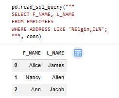
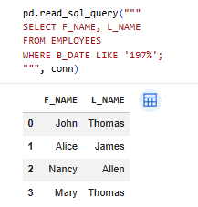
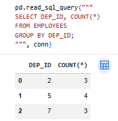
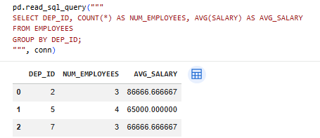
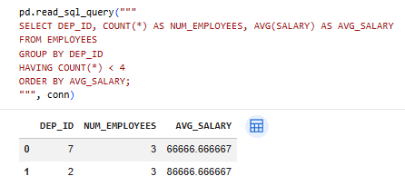

# sql-data-analysis-hr-database
SQL data analysis project using Python (SQLite) and Pandas to query and analyze HR dataset.
# SQL Data Analysis – HR Database

This project demonstrates how to perform SQL-based data analysis using Python, SQLite, and Pandas in Google Colab.

---

## Project Overview

In this project, I:

- Created relational database tables using SQL
- Loaded structured data from CSV files
- Queried the database using SQL within Python
- Analyzed data using filtering, sorting, grouping, and aggregation

---

## Tools & Technologies

- Python
- SQLite
- Pandas
- SQL
- Google Colab

---

## Key SQL Concepts Used

- **Filtering:** `WHERE`, `LIKE`, `BETWEEN`
- **Sorting:** `ORDER BY`
- **Grouping:** `GROUP BY`
- **Aggregation:** `COUNT()`, `AVG()`
- **Advanced Filtering:** `HAVING`

---

## Dataset

The dataset includes:

- Employees
- Departments
- Jobs
- Locations
- Job History

---

## Key Insights

- Analyzed employee distribution across departments
- Calculated average salary per department
- Identified departments with fewer employees using HAVING

---

## 📎 Notebook

See the full analysis here:  
`sql-data-analysis-hr-database.ipynb`

---

##  Learnings

- Learned how to integrate SQL with Python
- Improved understanding of GROUP BY vs HAVING
- Gained experience working with structured datasets
## Filtering Example

Example of filtering employee data using WHERE and LIKE:

### Filtering by Birth Year

Example of filtering employees born in the 1970s using a WHERE condition:

## Grouping Example

Example of grouping employees by department and counting the number of employees in each department using GROUP BY:

## Aggregation Example

Example of calculating total employees and average salary per department using aggregate functions:

## Filtering Grouped Data (HAVING)

Example of filtering grouped results to show only departments with fewer than 4 employees:

---

## Author

Diane King  
